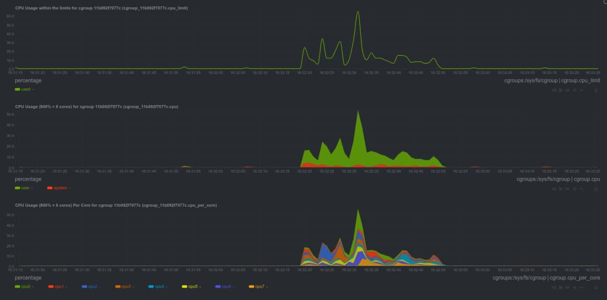
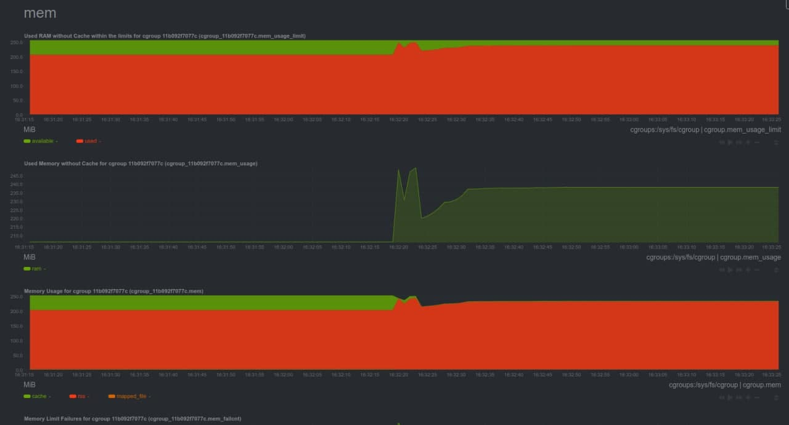
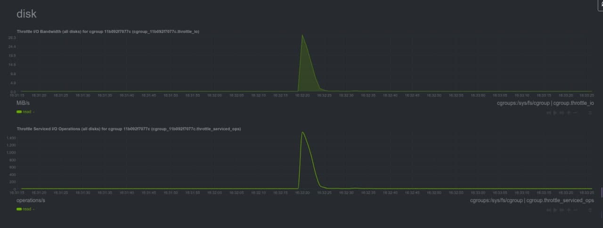
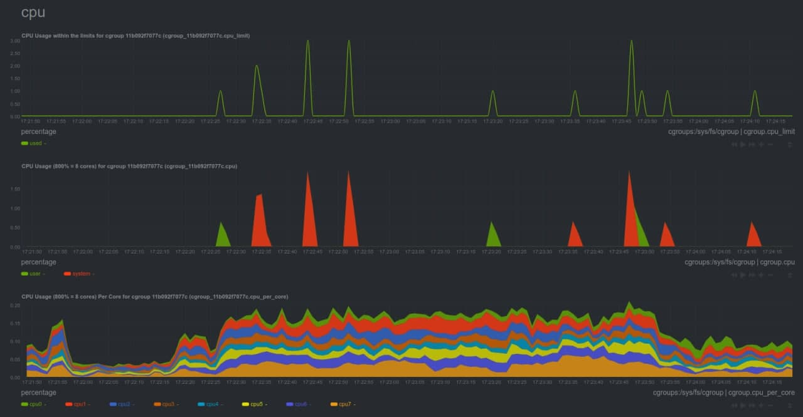
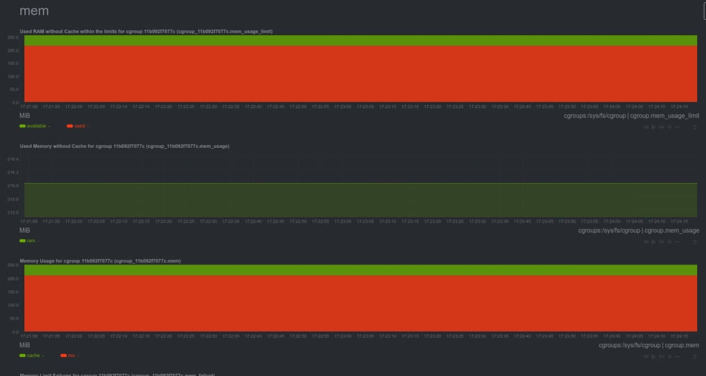
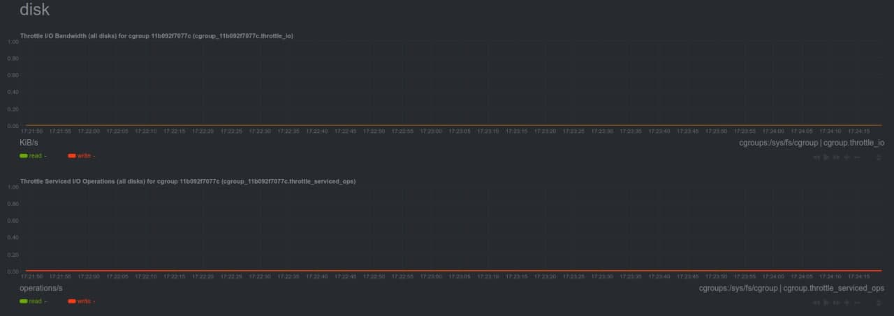
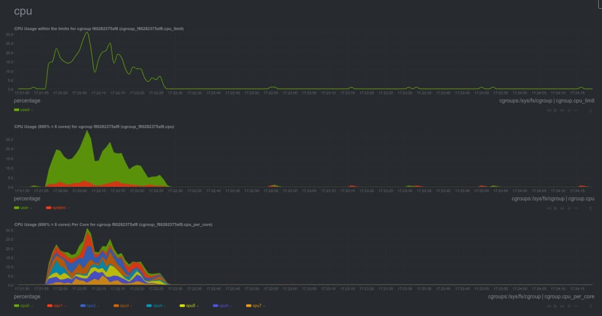
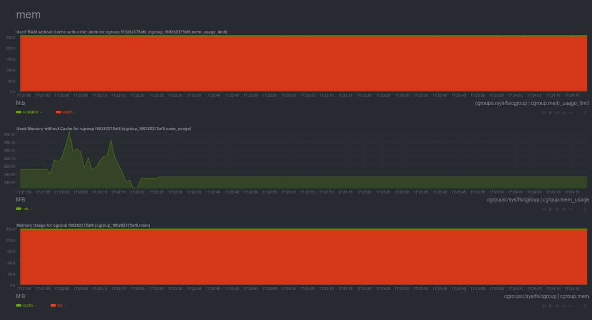
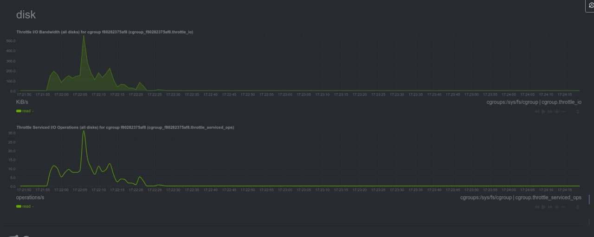

# Репликации MySQL

## Мониторинг ресурсов

Для мониторинга выбран https://hub.docker.com/r/netdata/netdata. Был добавлен сервис в docker-compose.yaml.

## Нагрузочное тестирование до репликации

Выбраны запрос: поиск по имени и фамилии. Для того, чтобы нагрузить диск, был выполнен отказ от покрывающего индекса.

```
wrk -s bench_search.lua -d 30s -t 4 -c 50 --timeout 30s --latency http://localhost:8083/
```

### CPU




### Memory




### DISK




## Настраиваем асинхронную репликацию


### Запустить мастер с включенным binary log

1. В конфигурации мастера добавлено

[mysqld]
server-id=1
log-bin=mysql-bin

2. Мастер был запущен

3. Проверил, что log bin включен.
```txt
mysql> show variables like "%log_bin%";
+---------------------------------+--------------------------------+
| Variable_name                   | Value                          |
+---------------------------------+--------------------------------+
| log_bin                         | ON                             |
| log_bin_basename                | /var/lib/mysql/mysql-bin       |
| log_bin_index                   | /var/lib/mysql/mysql-bin.index |
| log_bin_trust_function_creators | OFF                            |
| log_bin_use_v1_row_events       | OFF                            |
| sql_log_bin                     | ON                             |
+---------------------------------+--------------------------------+

mysql> SHOW MASTER STATUS;
+------------------+----------+--------------+------------------+-------------------+
| File             | Position | Binlog_Do_DB | Binlog_Ignore_DB | Executed_Gtid_Set |
+------------------+----------+--------------+------------------+-------------------+
| mysql-bin.000003 |      154 |              |                  |                   |
+------------------+----------+--------------+------------------+-------------------+
```

```txt
root@32865b26845a:/# ls -alh /var/lib/mysql/  | grep mysql-bin

-rw-r----- 1 mysql mysql  154 Dec 27 09:19 mysql-bin.000001
-rw-r----- 1 mysql mysql   19 Dec 27 09:19 mysql-bin.index
```

### Создать пользователя для реплики

Был создан пользователь `rep1` с паролем `123456`.

```
mysql> CREATE USER 'rep1'@'%' IDENTIFIED BY '123456';
Query OK, 0 rows affected (0.05 sec)

mysql> GRANT REPLICATION SLAVE ON *.* TO 'rep1'@'%';
Query OK, 0 rows affected (0.01 sec)
```

## Настройка слейва

0. 

Был сделан snapshot данных мастера

```
docker-compose exec db mysqldump --all-databases --master-data > dbdump.db 
```

1. Был добавлен новый сервис db_slave с настройками.

Был также включен binary log, так как далее планируется эксперимент с переключением слейва как мастера.

```txt
[mysqld]
server-id=21
log-bin=mysql-bin
```


2. Мастер установлен в качестве источника данных 

```
mysql> CHANGE MASTER TO MASTER_HOST='db', MASTER_USER='rep1', MASTER_PASSWORD='123456', MASTER_LOG_FILE='mysql-bin.000004', MASTER_LOG_POS=609;

mysql> SHOW SLAVE STATUS\G
*************************** 1. row ***************************
               Slave_IO_State: 
                  Master_Host: db
                  Master_User: rep1
                  Master_Port: 3306
                Connect_Retry: 60
              Master_Log_File: mysql-bin.000003
          Read_Master_Log_Pos: 595
               Relay_Log_File: 858beb3879c1-relay-bin.000001
                Relay_Log_Pos: 4
        Relay_Master_Log_File: mysql-bin.000003
             Slave_IO_Running: No
            Slave_SQL_Running: No

mysql> START SLAVE;
```

3. Проверка репликации

На мастере

```
mysql> CREATE TABLE test (id integer not null);
Query OK, 0 rows affected (0.01 sec)

mysql> insert into test (id) values (1);
Query OK, 1 row affected (0.04 sec)

mysql> insert into test (id) values (2);
Query OK, 1 row affected (0.01 sec)

mysql> insert into test (id) values (3);
Query OK, 1 row affected (0.02 sec)
```

На слейве:

```
mysql> select * from test;
+----+
| id |
+----+
|  1 |
|  2 |
|  3 |
+----+
3 rows in set (0.00 sec)
```

## Нагрузочное тестирование после репликации

Выбраны запрос: поиск по имени и фамилии. Для того, чтобы нагрузить диск, был выполнен отказ от покрывающего индекса.

```
wrk -s bench_search.lua -d 30s -t 4 -c 50 --timeout 30s --latency http://localhost:8083/
```

### CPU (MASTER)




### Memory (MASTER)




### DISK (MASTER)




### CPU (SLAVE)




### Memory (SLAVE)




### DISK (SLAVE)




## Включить row-based replication

Выставим binlog_format=ROW на мастере и на слейве. После перезапуска сервера, убедились, что репликация продолжает работать.

## Проверка

```
mysql> SHOW GLOBAL VARIABLES LIKE 'binlog_format';
+---------------+-------+
| Variable_name | Value |
+---------------+-------+
| binlog_format | ROW   |
+---------------+-------+
1 row in set (0.01 sec)
```

## Обзор binlog (RBR)

```
> update test2 set id = 50000;
```

```
mysqlbinlog --base64-output=DECODE-ROWS -vv mysql-bin.000006


#201227 13:07:50 server id 1  end_log_pos 686 CRC32 0x2dfb7f65 	Update_rows: table id 108 flags: STMT_END_F
### UPDATE `network`.`test2`
### WHERE
###   @1=100 /* INT meta=0 nullable=1 is_null=0 */
### SET
###   @1=50000 /* INT meta=0 nullable=1 is_null=0 */
### UPDATE `network`.`test2`
### WHERE
###   @1=1000 /* INT meta=0 nullable=1 is_null=0 */
### SET
###   @1=50000 /* INT meta=0 nullable=1 is_null=0 */
### UPDATE `network`.`test2`
### WHERE
###   @1=1000 /* INT meta=0 nullable=1 is_null=0 */
### SET
###   @1=50000 /* INT meta=0 nullable=1 is_null=0 */
### UPDATE `network`.`test2`
### WHERE
###   @1=1000 /* INT meta=0 nullable=1 is_null=0 */
### SET
###   @1=50000 /* INT meta=0 nullable=1 is_null=0 */
### UPDATE `network`.`test2`
### WHERE
###   @1=5000 /* INT meta=0 nullable=1 is_null=0 */
### SET
###   @1=50000 /* INT meta=0 nullable=1 is_null=0 */

```

## Обзор binlog (SBR)

```
mysql> SHOW GLOBAL VARIABLES LIKE 'binlog_format';
+---------------+-----------+
| Variable_name | Value     |
+---------------+-----------+
| binlog_format | STATEMENT |
```

```
mysqlbinlog --base64-output=DECODE-ROWS -vv mysql-bin.000007


# at 304
#201227 13:10:30 server id 1  end_log_pos 411 CRC32 0xe9cab265 	Query	thread_id=2	exec_time=0	error_code=0
use `network`/*!*/;
SET TIMESTAMP=1609074630/*!*/;
update test2 set id = 25000
/*!*/;

```